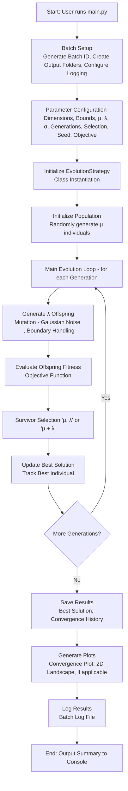
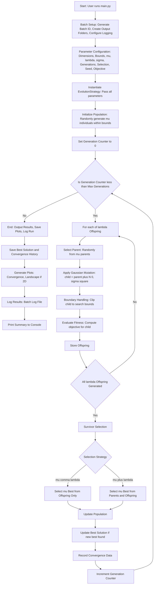

# first version 0.01

```mermaid

flowchart TD
    A["Start: User runs main.py"] --> B["Batch Setup<br>Generate Batch ID, Create Output Folders, Configure Logging"]
    B --> C["Parameter Configuration Dimensions, Bounds, μ, λ, σ, Generations, Selection, Seed, Objective"]
    C --> D["Initialize EvolutionStrategy<br>Class Instantiation"]
    D --> E["Initialize Population<br>Randomly generate μ individuals"]
    E --> F["Main Evolution Loop - for each Generation"]
    F --> G["Generate λ Offspring<br>Mutation - Gaussian Noise -, Boundary Handling"]
    G --> H["Evaluate Offspring Fitness<br>Objective Function"]
    H --> I@{ label: "Survivor Selection 'μ, λ' or 'μ + λ'" }
    I --> J["Update Best Solution<br>Track Best Individual"]
    J --> K{"More Generations?"}
    K -- Yes --> F
    K -- No --> L["Save Results<br>Best Solution, Convergence History"]
    L --> M["Generate Plots<br>Convergence Plot, 2D Landscape, if applicable"]
    M --> N["Log Results<br>Batch Log File"]
    N --> O["End: Output Summary to Console"]
    I@{ shape: rect}

```

# Second version - 0.02

```mermaid

flowchart TD
    A["Start: User runs main.py"]
    B["Batch Setup: Generate Batch ID, Create Output Folders, Configure Logging"]
    C["Parameter Configuration: Dimensions, Bounds, mu, lambda, sigma, Generations, Selection, Seed, Objective"]
    D["Instantiate EvolutionStrategy: Pass all parameters"]
    E["Initialize Population: Randomly generate mu individuals within bounds"]
    F["Set Generation Counter to 0"]
    G{"Is Generation Counter less than Max Generations"}
    H["For each of lambda Offspring"]
    I["Select Parent: Randomly from mu parents"]
    J["Apply Gaussian Mutation: child = parent plus N 0, sigma square"]
    K["Boundary Handling: Clip child to search bounds"]
    L["Evaluate Fitness: Compute objective for child"]
    M["Store Offspring"]
    N{"All lambda Offspring Generated"}
    O["Survivor Selection"]
    O1{"Selection Strategy"}
    P["Select mu Best from Offspring Only"]
    Q["Select mu Best from Parents and Offspring"]
    R["Update Population"]
    S["Update Best Solution if new best found"]
    T["Record Convergence Data"]
    U["Increment Generation Counter"]
    Z["End: Output Results, Save Plots, Log Run"]
    AA["Save Best Solution and Convergence History"]
    AB["Generate Plots: Convergence, Landscape if 2D"]
    AC["Log Results: Batch Log File"]
    AD["Print Summary to Console"]

    A --> B
    B --> C
    C --> D
    D --> E
    E --> F
    F --> G
    G -- No --> Z
    G -- Yes --> H
    H --> I
    I --> J
    J --> K
    K --> L
    L --> M
    M --> N
    N -- No --> H
    N -- Yes --> O
    O --> O1
    O1 -- mu comma lambda --> P
    O1 -- mu plus lambda --> Q
    P --> R
    Q --> R
    R --> S
    S --> T
    T --> U
    U --> G
    Z --> AA
    AA --> AB
    AB --> AC
    AC --> AD
```