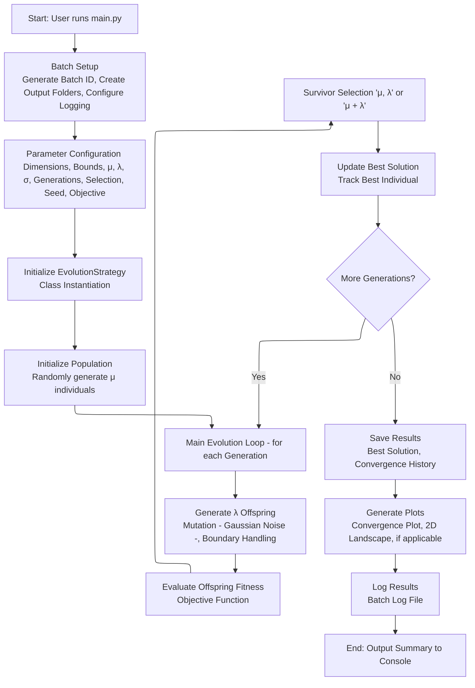

```mermaid
---
config:
  layout: elk
  theme: default
---
flowchart TD
    A["Start: User runs main.py"] --> B["Batch Setup<br>Generate Batch ID, Create Output Folders, Configure Logging"]
    B --> C["Parameter Configuration Dimensions, Bounds, μ, λ, σ, Generations, Selection, Seed, Objective"]
    C --> D["Initialize EvolutionStrategy<br>Class Instantiation"]
    D --> E["Initialize Population<br>Randomly generate μ individuals"]
    E --> F["Main Evolution Loop - for each Generation"]
    F --> G["Generate λ Offspring<br>Mutation - Gaussian Noise -, Boundary Handling"]
    G --> H["Evaluate Offspring Fitness<br>Objective Function"]
    H --> I@{ label: "Survivor Selection 'μ, λ' or 'μ + λ'" }
    I --> J["Update Best Solution<br>Track Best Individual"]
    J --> K{"More Generations?"}
    K -- Yes --> F
    K -- No --> L["Save Results<br>Best Solution, Convergence History"]
    L --> M["Generate Plots<br>Convergence Plot, 2D Landscape, if applicable"]
    M --> N["Log Results<br>Batch Log File"]
    N --> O["End: Output Summary to Console"]
    I@{ shape: rect}

```